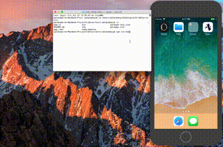

# expo-detox-example
UI Test tool -> [wix/detox](https://github.com/wix/detox)  
  
Demonstrates integration of the Detox gray box end-to-end testing library with Expo.  
Uses [detox-expo-helpers](https://github.com/expo/detox-expo-helpers).



## step

### install dependencies
```bash
$ npm install
$ npm install --save-dev detox detox-expo-helpers mocha
```

### expo client app copy to bin
```bash
$ mkdir bin
$ mv ~/.expo/ios-simulator-app-cache/Exponent-xxx.app bin/Exponent-xxx.app
```
If no Exponent-xxx.app, open on iOS Simulator any expo apps by xde.  
For this example, Exponent-xxx.app is zipped, and put it in the bin.

### add detox configuration on package.json
```js:package.json
{
  ...
  "detox": {
    "configurations": {
      "ios.sim": {
        "binaryPath": "bin/Exponent-xxx.app", //latest expo client app
        "type": "ios.simulator",
        "name": "iPhone 7" //select iPhone 7, iPhone 8, other...
      }
    }
  }
}
```

### create test file
```js:e2e/firstTest.spec.js
const { reloadApp } = require('detox-expo-helpers');

function timeout(ms) {
  return new Promise(resolve => setTimeout(resolve, ms));
}

describe('Example', () => {
  beforeEach(async () => {
    await reloadApp();
    await timeout(30000);
  });

  it('should have welcome screen', async () => {
    await expect(element(by.id('welcome'))).toBeVisible();
    await element(by.id('login_button')).tap();
    await expect(element(by.id('email'))).toBeVisible();
    await element(by.id('email')).replaceText("email_is_here");
    await expect(element(by.label('Login!!!'))).toBeVisible();
  });
});
```
**If cannot find UI Element error appeared, timeout(ms) is neccessary.**  
**[Please see this issue](https://github.com/expo/with-detox-tests/issues/2)**

### Try it out
```bash
$ npm run e2e
```
